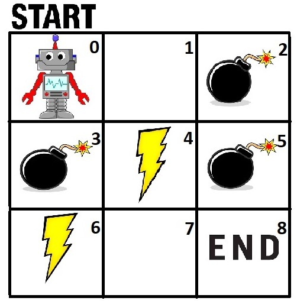

# Reinforcement-Learning
This repository illustrates the technique of Q-leaning, which is a type of reinforcement learning algorithm. A robot is trained to navigate through a maze using the reward-punishment system.

For the first half of the training process, the robot explores the environment more, and learns about its surroundings. In the second half of the training process, it exploits the environment using the information it has gathered. This process is called the 'Exploration vs Exploitation' tradeoff. It achieves this with a help of a q-table which contains q-values for each state-action pair. For a particular state, the robot chooses the action with the highest q-value.

